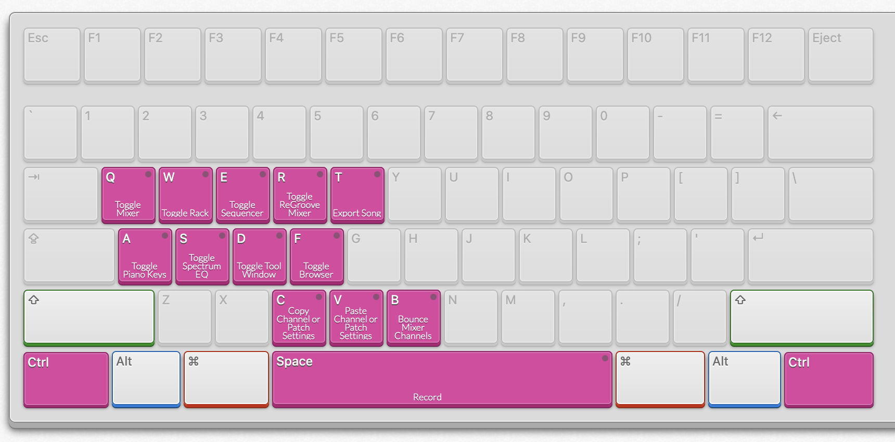
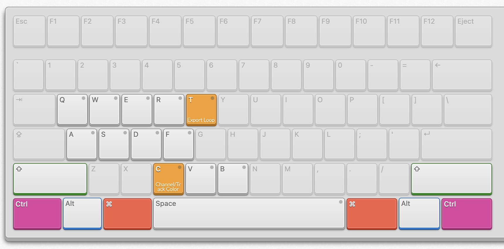
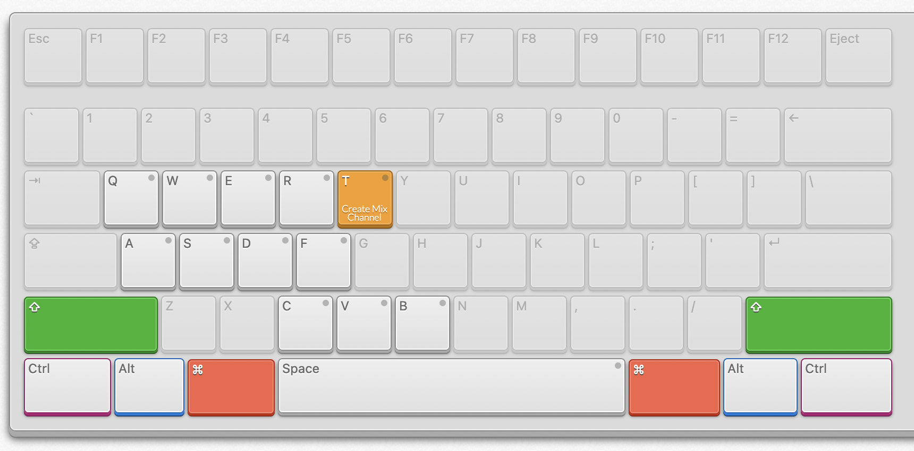
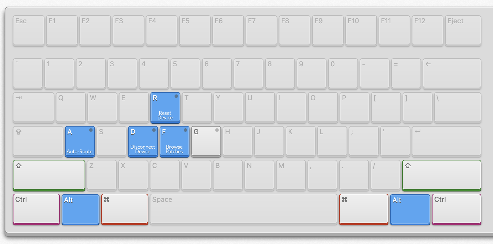
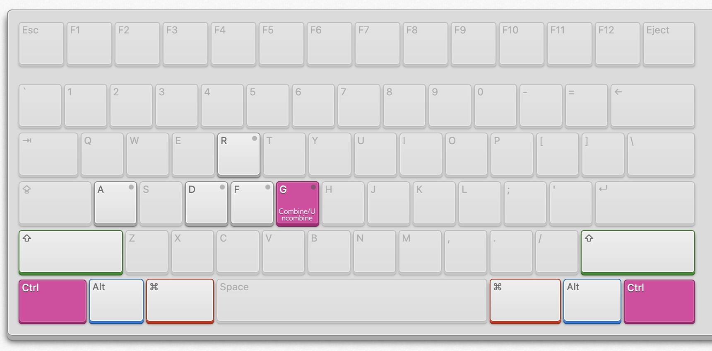
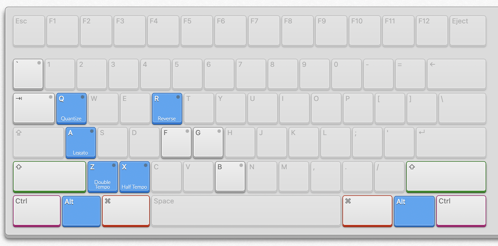
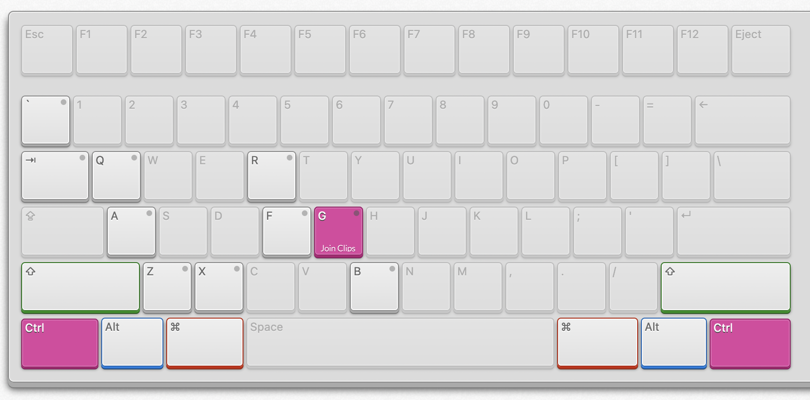
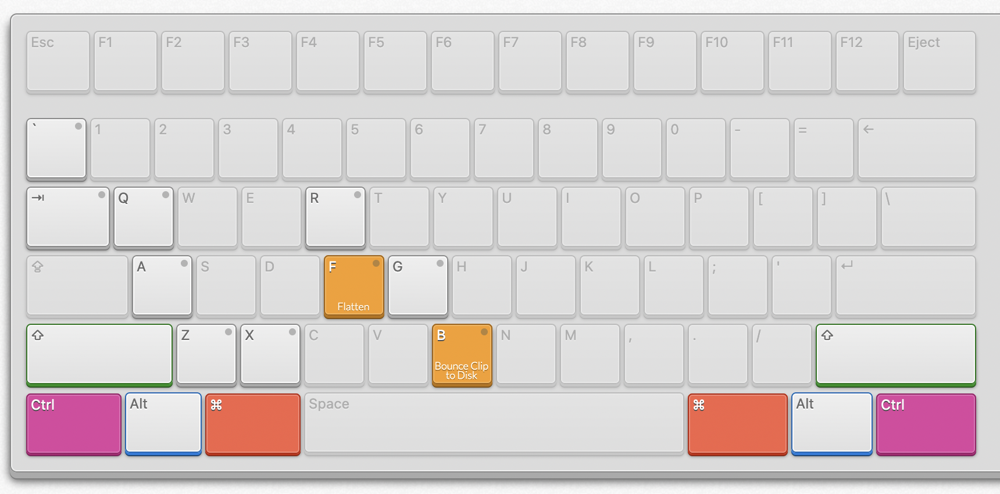
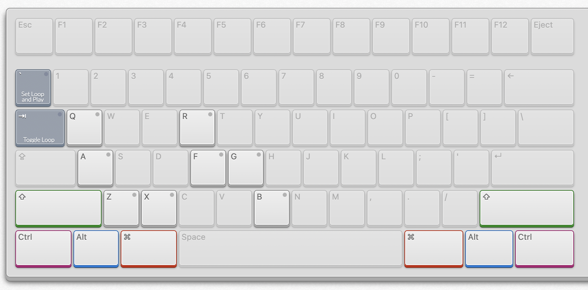

# Keybinds

## Intro

This Spoon assumes a few things about how the user interacts with Reason. Most importantly, it assumes that you only have one of the Mixer, the Rack or the Sequencer in view at any given time, taking up the full window. I find this to be my preferred way to work in Reason, though I know many people like to have different views open at the same time. I can't guarantee that all of the modes will work properly if you use split views, but they should function somewhat reliably.

Also assumed is that you're using a mouse/pointing device with 5 buttons, e.g. thumb buttons or extra macro buttons on a trackball. If you're not, you will miss out on the mouse delete/mute functionality but you'll still be able to use everything else.

Not required but recommended: using a utility like [Karabiner-Elements](https://karabiner-elements.pqrs.org/) to remap Caps Lock to Ctrl, for easier use of the Ctrl key shortcuts, of which there are many.

## Global

</img> </img> </img> 

## Rack

</img> </img> 

## Sequencer
</img> </img> </img> </img> 

## Mouse Actions

Mouse4 and Mouse5 are remapped to Mute Clip and Delete, respectively (you can also Cmd + Delete). In tandem with the other shortcuts, this allows you to keep your hand on the mouse almost all of the time. There are unfortunately no equivalent actions for the touchpad, since Hammerspoon does not support gesture events, but I find that it's not too inefficient to just press M and Delete normally when I'm on the touchpad.

## Credits

All images were generated using [ShortcutMapper](https://github.com/waldobronchart/ShortcutMapper) by Waldo Bronchart.